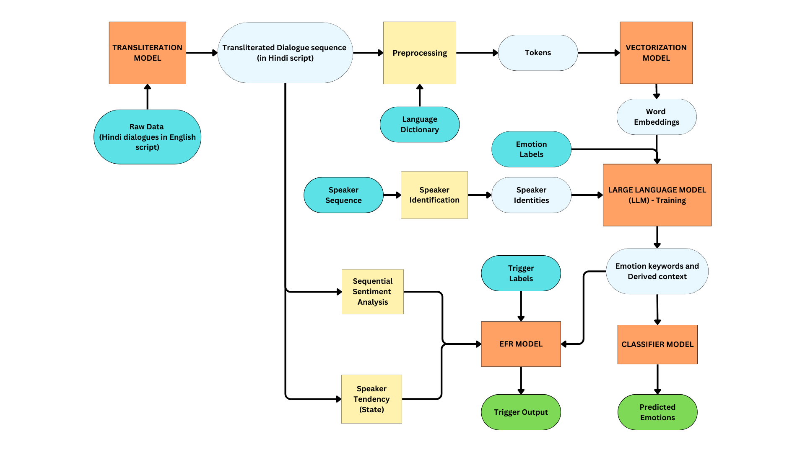

# Minor-Project
## EDIREF: Emotion Discovery and Reasoning its Flip in Conversation

**Author: Tirth Bhupendra Dalwadi**

EDIREF is an NLP research project focused on detecting emotional states in multi-turn dialogues and, more importantly, identifying the specific "flip" points where a user's emotion shifts (e.g., from Neutral to Frustrated). This was developed as a Minor Project during my 7th semester.

## 🧠 The Core Problem
Most emotion recognition systems analyze text in isolation. EDIREF moves beyond static analysis to understand Emotional Dynamics. By reasoning why an emotion flips, the model provides better context for conversational AI and mental health monitoring tools.

## 🚀 Key Features
**Contextual Emotion Detection:** Analyzes the current utterance in the context of previous dialogue turns.

**Flip Reasoning:** Identifies the "trigger" tokens or phrases that cause a transition between emotional states.

**Transformer-Based Architecture:** Utilizes fine-tuned BERT and RoBERTa models to capture subtle linguistic cues in human conversation.

## 🛠️ Technical Stack
**Frameworks:** PyTorch, Hugging Face Transformers

**Models:** BERT-base, RoBERTa

**Dataset:** Semeval Dataset on TV Shows (English and Hindi dialogues).

**Tools:** Python, Scikit-learn (for evaluation metrics)

